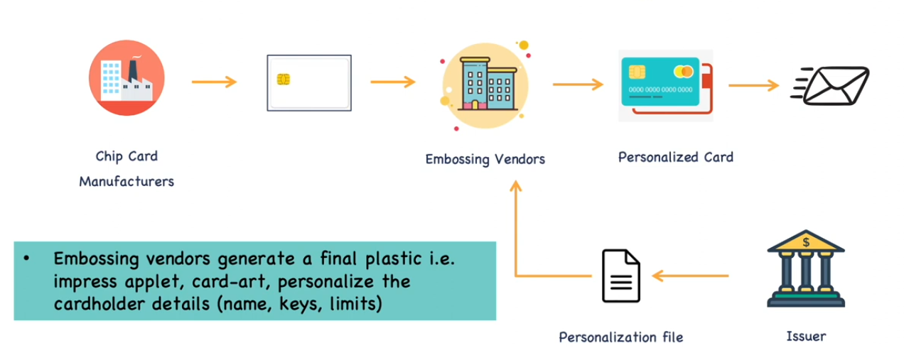

# Introduction EMV

## Type of Smart Cards

1. Memory Cards (Memory ONLY)
2. Intelligent Smart Cards (Memory + Microprocessor)

Memory Cards = Phone Memory SD cards of Flash drives
Intelligent Smart Cards = ID Cards or Payment Cards

## Type of Smart Cards

IC Cards (Contact)
- Governed by ISO-7816

Propietary Procimity Cards
- e.g. ID Cards

IC Cards (Contactless)
- Governed by ISO-14443

## Smart Cards - Protocols
- ISO-7816, ISO-14443 are generic Contact and Contactless protocols not specific for Payments
- EMV (Europay Mastercard Visa)
- They adopted ISO/EIC protocols and created new standard for contact and contacless Cards.
- This is calles EMV protocols
- This EMC standard has commands specific for Payments protocols
- Earlier there were either Contact OR contactless Cards. Now, there ares cards that offer both
- Concact and Contactless: Dual Interface Chips.

## Architecture of Chip Cards

- Applications: Applets: M/Chip, VSDC
- Operating system: MULTOS, JavaCard
- Hardware: ICC Chip

EMV Applications Applets:
- Mastercard: M/Chip
- Visa: VSDC (Visa Smart Debit/Credit Cards)
- AMEX: AEIPS (AMEX ICC Payment Specifications)
- JCB: JSmart
- NPCI: RuPAY
- CUP/UPI: UICS

## HL Process-Flow of EMV Card generation

