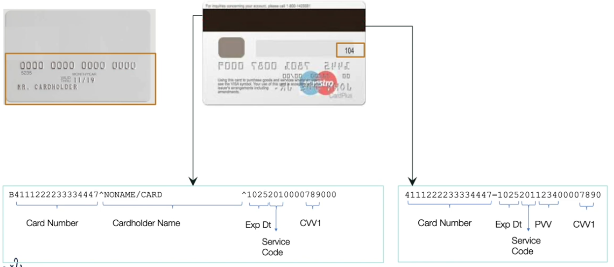
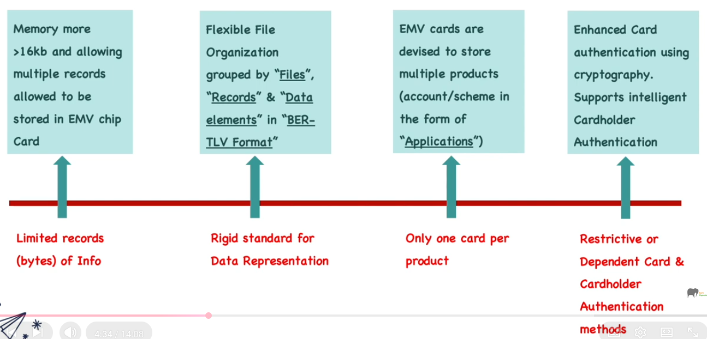
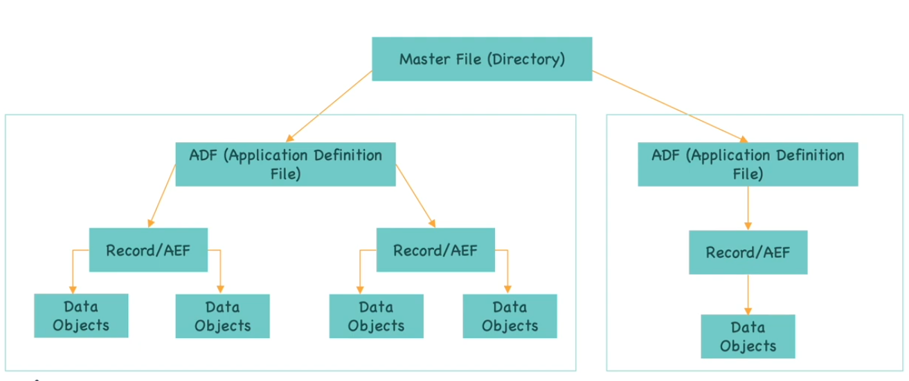
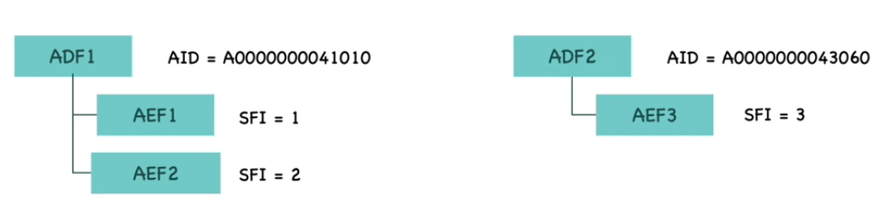
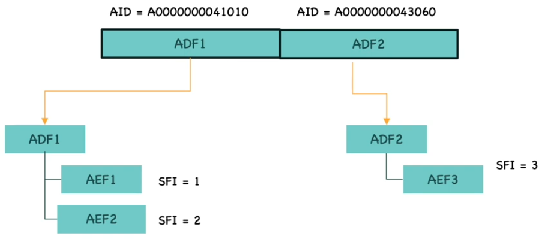
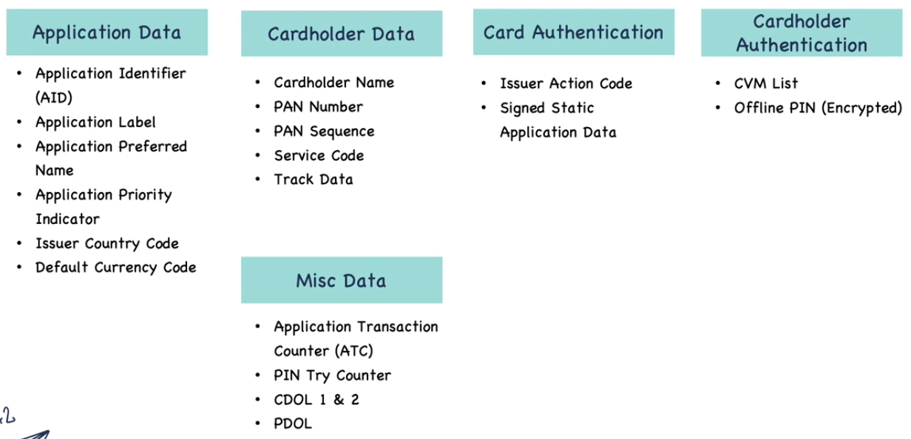

# EMV Chip Application: Introduction to Files & Data inside Chip

## Background: Magnetic Stripe

- One Card per Product (per Account or Scheme product)
- Minimal Information storage
- Data format was not flexible
- Can not update after issuance

## Background: Magnetic Stripe (II)

- Card Authentication means ensure that the card is a valid card
- Cardholder Authentication means ensuring cardholder is valid
- In case of Magnetic Stripe
  - Card Authentication is by looking the card
  - CArdholder Authentication is always online PIN or Merchant verifies the Signature

## Advantages of EMV

## Aplications (Applets)

- Application correspond to an unique product
- Product refers to Scheme products

If there is a MasterCard Credit card and Maestro Debit card
- MasterCArd Credit Card has its own Application
- Maestro Debit Card has its own Application

Applications are referred by it's AID (application identifier)
- MasterCard Credit Card is A0000000041010
- Maestro Debit Card is A0000000043060

### File Organization

- MF (Master File)
  - ADF (Application Definition File)
    - Record/ AEF (Application Elementary File)
      - Data Objects (TLV: Tag Length Value)

### Data eleemtns & Objects
- Data Objects ares smalllest piece of information
  - e.g. PAN, cardholder name, track1, track2, service code, currency code
  - Each data element is assigned a unique tag
  - Every DE is stpred in the format of Tag Lenght Value (TLV)
  - Example:
    - 5A 08 4761739001010010
      - Tag: 5A
      - Length: 08
      - Value: 4761739001010010

### ADF - Application Definition File

- ADF (application definition file)
  - Multiple AEFs (Application Elementary File) grouped together form an ADF
  - Every unique Application has an ADF
  - Within ADF, each AEF would have a unique SFI (Short File Identifier) with which the AEF would be addressed

### Directory Definition File (DDF)

Directory Definition File
- It's a directoy (index) to all ADF
- Used to locate the ADF based on the Application ID
- For chip cards this file name should be "1PAY.SYS.DDF01"

### Important Data Elements

